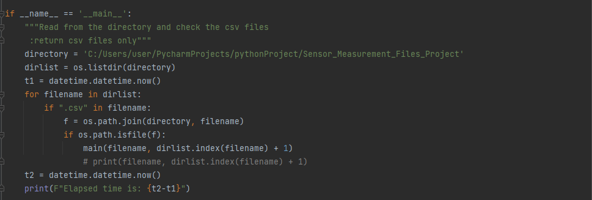
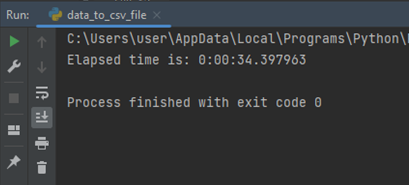
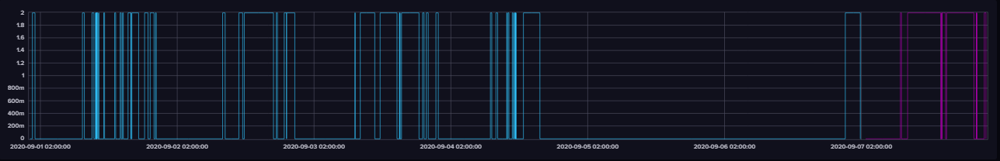
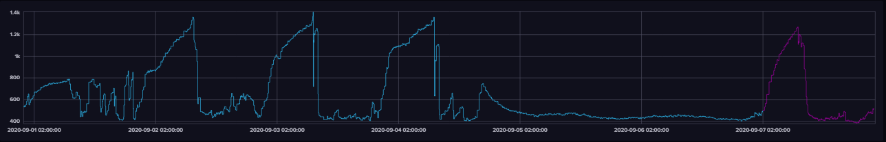
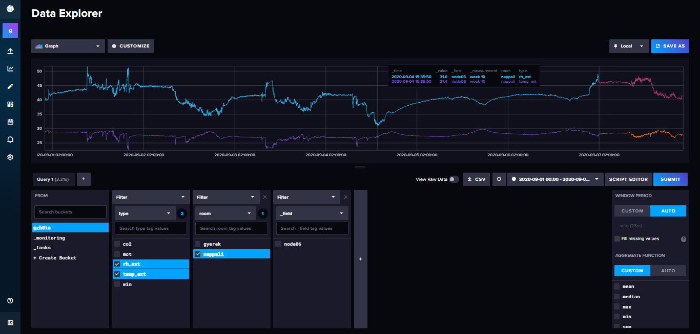

# **Smart Home System**

A smart home has been equipped with measurement sensors located in Budapest, Hungary. The practice is a monitoring sensor system where measurements inside this home for the following parameters temperature, relative humidity and CO2 are carried out. Moreover, the user behavior such as window opening, and external shutter position are included. The measurements are being taken from sensors distributed in the rooms of this home.
These measurements are transferred from the sensors through gateway then stored at the server as time-series data.
The data will be uploaded to influx database to witness the variations as well as to detect special events and find correlation.

### **Data Analysis**

The data of the building are carried out in CSV files. These data are to be uploaded to the database. In this case, influx DB is used because the data are timed series.
Influx DB has specific methods to upload data. In this project, the data were uploaded using the CSV annotated file format through the influx DB web interface.
There are 80 files to be uploaded. To facilitate the process, a python script has been written to process these files efficiently. The following steps are carried out:

**•	Reading data**

Using “with open” in python, allows to load data to the development environment.

**• Modifying data**

The date format has been modified from dots to dashes.

**•	Merging data**

The time and date are merged to make them compatible with annotated csv file standard.

**•	Sorting data**

The data are sorted according to the annotated csv file order.

**•	Writing files**

The cleaned data are saved into new csv file.

Due to the huge number of files, the following method has been implemented to loop over the files in an allocated directory to modify them one by one instantaneously.

**Note: It is important to define the directory path for the files in the variable called “directory”**

The elapsed time has been recorded by the script. The process took approximately 34 seconds. It can be differed from device to another.

**Uploading files**

The generated files have been uploaded to influx DB server to visualize the data.

### **Visualizing Data**

The following graphs represent the events for nappali room during the first week of September 2020:

1) Window Opening

2) CO2 concentration

3) Relative humidity & Temperature

The graphs show that CO2 concentration is reversely proportional on windows openings. The concentration increases when the window is closed, and it starts to decrease when the window in open.
Relative humidity and Temperature are also reversely proportional. These values are almost constant when the window is closed. However, they start to change when the window is opened.
With influx web interface, it is possible to retrieve the data for temperature, relative humidity and CO2 concentration at any time interval and the user behavior concerning window opening.